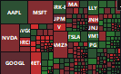

# Nireum Heatmap

A minimal desktop widget for visualizing S&P 500 market trends at a glance.




## Features

- Mini widget mode - compact, always on top
- Expanded view with sector breakdown
- Auto-refresh during market hours
- Gradient colors based on price change

## Installation

From source:
```
pip install PyQt5 yfinance pandas
python heatmap_widget.py
```

## Disclaimer

This project uses data from Yahoo Finance via the [yfinance](https://github.com/ranaroussi/yfinance) library.

Yahoo!, Y!Finance, and Yahoo! Finance are registered trademarks of Yahoo, Inc.
This project is not affiliated with, endorsed, or vetted by Yahoo, Inc.

Data may be delayed 15-20 minutes and should not be used as investment advice.

## Known Issues

- Some tickers may occasionally fail to fetch data due to yfinance API instability
- If a stock appears gray, data was temporarily unavailable (cached values are used when possible)

## License

MIT
